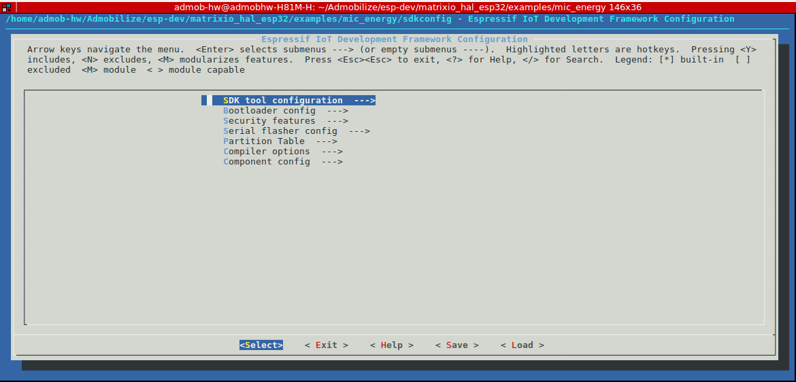

# MATRIX Voice HAL for ESP32
This is the official set of ESP-IDF components for [MATRIX Voice](https://www.matrix.one/products/voice). 

## Get Started

**MATRIX Voice ESP32** has an ESP32 WROOM. To develop applications for MATRIX Voice ESP32 you need:

* **PC** with either Windows, Linux or MAC operating system.
* **ESP32 Toolchain** to compile applications for ESP32.
* **ESP IDF**, the API for the ESP32.
* **Raspberry PI** to connect the MATRIX Voice and upload the Software into the ESP32 and keep update the **FPGA** firmware.

## ESP-IDF and Toolchain Setup (PC)

### ESP32 toolchain 

Follow the instructions according to your operating system to set up the ESP32 toolchain:

[https://esp-idf.readthedocs.io/en/latest/get-started/index.html#setup-toolchain](https://esp-idf.readthedocs.io/en/latest/get-started/index.html#setup-toolchain)

### ESP-IDF development framework

See setup guides for detailed instructions to set up the ESP-IDF:

[https://github.com/espressif/esp-idf](https://github.com/espressif/esp-idf)

#### Linux

It is recommended to set the PATH and IDF_PATH environment variables in the ~/.bashrc file

```
export PATH="$PATH:<route to toolchain>/xtensa-esp32-elf/bin"
export IDF_PATH=<route to ESP-IDF>/esp-idf
```

## Cloning & Compiling 

Clone de repo MATRIX Voice HAL

```
git clone https://github.com/matrix-io/matrixio_hal_esp32.git
```

Everloop example

```
cd matrixio_hal_esp32/examples/arc_demo
make menuconfig
```

Configure your ESP framework envioroment. Save your configuration and then exit the application. 



Now build the application with:

```
make
```


## Deploy & Uploading

