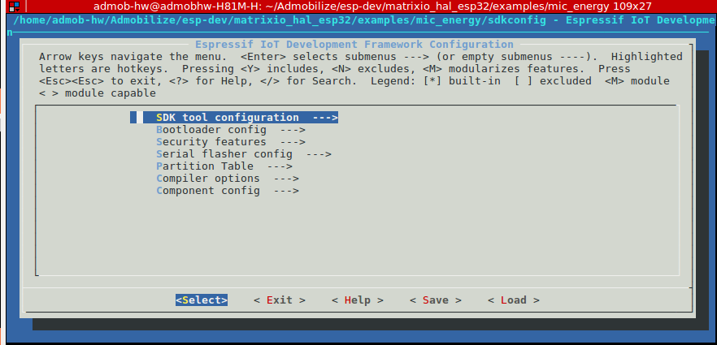

# MATRIX Voice HAL for ESP32
This is the official set of ESP-IDF components for [MATRIX Voice](https://www.matrix.one/products/voice). 

## Get Started

**MATRIX Voice ESP32** has an ESP-WROOM-32. To develop applications for MATRIX Voice ESP32 you need:

* **PC** with either Windows, Linux or MAC operating system.
* **ESP32 Toolchain** to compile applications for ESP32.
* **ESP IDF**, the API for the ESP32.
* **Raspberry PI** to connect the MATRIX Voice and upload the Software into the ESP32 and keep updated the **FPGA** firmware.

## Pre-Requisites (Raspberry Pi)

Install the MATRIX Voice software in the **Raspberry PI**. It keeps the **FPGA** firmware updated and install few tools to flash the ESP-WROOM-32. 

```
# Add repo and key
curl https://apt.matrix.one/doc/apt-key.gpg | sudo apt-key add -
echo "deb https://apt.matrix.one/raspbian $(lsb_release -sc) main" | sudo tee /etc/apt/sources.list.d/matrixlabs.list

# Update packages and install
sudo apt-get update
sudo apt-get upgrade

# Installation
sudo apt install matrixio-creator-init
```

## ESP-IDF and Toolchain Setup (PC)

### ESP32 toolchain 

Follow the instructions according to your operating system to set up the ESP32 toolchain:

[https://esp-idf.readthedocs.io/en/latest/get-started/index.html#setup-toolchain](https://esp-idf.readthedocs.io/en/latest/get-started/index.html#setup-toolchain)

### ESP-IDF development framework

See setup guides for detailed instructions to set up the ESP-IDF:

[https://github.com/espressif/esp-idf](https://github.com/espressif/esp-idf)

#### Linux

It is recommended to set the PATH and IDF_PATH environment variables in the ~/.bashrc file

```
export PATH="$PATH:<route to toolchain>/xtensa-esp32-elf/bin"
export IDF_PATH=<route to ESP-IDF>/esp-idf
```

## Cloning, Compiling & Deploy

Clone de repo MATRIX Voice HAL

```
git clone https://github.com/matrix-io/matrixio_hal_esp32.git
```

Everloop example

```
cd matrixio_hal_esp32/examples/arc_demo
make menuconfig
```

Configure the ESP framework environment. Save your configuration and then exit the application. Default configuration works well. Just skip the setup pressing *Exit* in the first window. 



Now build the application with:

```
make
```

To deploy and flash the application into the ESP it's necessary to connect the MATRIX Voice to a Raspberry PI. 

```
$ export RPI_HOST=pi@RASPBERRY_IP_ADDRESS
$ make deploy

*********************************
Copying files to the Raspberry PI
*********************************
pi@RASPBERRY_IP_ADDRESS password: 
bootloader.bin                                                     100%   19KB   5.7MB/s   00:00    
arc_demo.bin                                                       100%  382KB  10.7MB/s   00:00    
partitions_singleapp.bin                                           100% 3072     2.6MB/s   00:00    

*********************************
Programmig the ESP32
*********************************
pi@RASPBERRY_IP_ADDRESS password: 
-----------------------------------
esptool.py wrapper for MATRIX Voice
-----------------------------------
esptool.py v2.2
Connecting......
Chip is ESP32D0WDQ6 (revision 1)
Uploading stub...
Running stub...
Stub running...
Configuring flash size...
Auto-detected Flash size: 4MB
Flash params set to 0x0220
Wrote 32768 bytes at 0x00001000 in 3.1 seconds (85.7 kbit/s)...
Hash of data verified.
Wrote 393216 bytes at 0x00010000 in 36.6 seconds (86.0 kbit/s)...
Hash of data verified.
Wrote 16384 bytes at 0x00008000 in 1.5 seconds (86.6 kbit/s)...
Hash of data verified.

Leaving...
Hard resetting...

```
